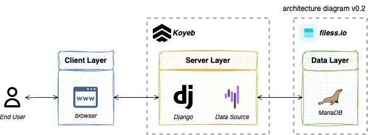

<!-- INTRODUCTION -->
# 💸 Anti-MPT

  
  
  

 [Modern Portfolio Theory](https://en.wikipedia.org/wiki/Modern_portfolio_theory) (MPT //_empty_//) is a widely used framework in finance that helps investors make informed decisions about their investments. It emphasises the importance of diversification and the trade-off between risk and return. However, as the pronunciation suggests, it would rather empty your portfolio than make you a millionaire.

In contrast, Anti-MPT is risk-seeking and argues against the diversification emphasised in MPT. It trades one and only one stock frequently, aiming to reenact the "buy low, sell high" strategy as much as possible. It embraces volatility to fill your pockets with cash, for _anti-empty_ is the name of the game.

**First Published:** 17 June 2025  
**Last Updated:** 17 June 2025

<!-- ROADMAP -->
## Table of Contents
- [1 - Motivation](#1)
- [2 - Strategy](#2)
    - [2.1 - Trading Performance](#2.1)
    - [2.2 - Limitation](#2.2)
- [3 - Solution Architecture](#3)
    - [3.1 - System Design](#3.1)

<!-- SECTION 1 -->

## Motivation: Stay Away from the Rooftop of Stock Square
No matter how many years you have been working, you still won't be able to build your nest egg unless Li Ka-Shing is your father. Many people start their journey in the stock market with the vain hope of becoming wealthy. However, they soon realise that the stock market is not as easy as they thought. It is extremely exhausting and difficult to make money in the stock market.

MPT emphasises diversification in investing to balance risk and return. Because it sounds like _empty_ in pronunciation, it will eventually _empty_ your portfolio after some time. Anti-MPT goes against the concepts introduced in MPT. It leverages reinforcement learning (RL) to identify positions that can generate the highest returns, ultimately outperforming ETF funds.

  
  
<i>you jump, but I'm not going to be nuts with you.</i>

<!-- SECTION 2 -->

## Strategy: Buy Low Sell High
Anti-MPT focuses on a single stock and trades it frequently. The strategy is simple: buy low and sell high. Everyone knows it, but no one can implement it in practice. Therefore, Anti-MPT leverages RL to determine the appropriate actions to maximise returns.

To reenact the strategy as much as possible, the selected stock should have high volatility and high returns. According to [Aswath Damodaran](https://pages.stern.nyu.edu/~adamodar/New_Home_Page/datafile/Betas.html), the _Building Supply_ sector has the highest beta among all industries as of January 2025. Anti-MPT favours [NYSE:WSM](https://finance.yahoo.com/quote/WSM/) because it has the highest Compound Annual Growth Rate within the industry. To compare the performance of Anti-MPT, the [S&P 500 Homebuilders Index](https://finance.yahoo.com/quote/XHB/) serves as a benchmark. While it is not a complete proxy for MPT, it is a relevant reference index.

  
  
<i>the bigger the risk, the bigger the reward.</i>

### Trading Performance: Resilience in Uncertainty
Multiple RL agents are trained on 10 years (2010 - 2020) of trading data, and are ensembled to vote for the best actions for Anti-MPT. As of May 2025, Anti-MPT has outperformed the proxy in both the development (2021 - 2024) and test sets (January - May 2025). Anti-MPT has demonstrated a strong ability to handle market uncertainty, even under the Liberation Day championed by Trump Trump. However, MPT, which refers to the S&P Index, has been severely impacted by the market and liberates your portfolio. That’s why we say MPT empties your pockets!

  
    
    
  
  
<i>backtest on development and test set, respectively.</i>

Going forward, Anti-MPT will continuously manage trades, and its performance will be available on its [dashboard](https://antimpt.koyeb.app/).

> [!NOTE]  
> Latency is expected because Anti-MPT relies on community servers.

> [!CAUTION]  
> Anti-MPT does not provide financial advice. Any actions taken based on the information presented in the dashboard are at your own risk.

### Limitation: Agnostic Results
Never take it too seriously. RL is indeed a powerful tool, but it is like a black box. You cannot explain why it sometimes buys high and sells low. Agents rely heavily on luck, just like Ethan Hunt. Anti-MPT has a fundamental issue: it is trained on Yahoo Finance data. It is not uncommon to adjust prices due to [corporate actions](https://ir.homedepot.com/stock-information/dividend-history), but the data provided by Yahoo Finance is inconsistent over time (reference: [here](https://github.com/ranaroussi/yfinance/issues/626), [here](https://github.com/ranaroussi/yfinance/issues/1871), and [more](https://stackoverflow.com/questions/62999147/inconsistent-data-being-downloaded-from-yahoo-finance-website)...).

Ages ago, a finance professor introduced a concept: _the wrong number to put in the wrong formula to get the right price_. To us, it feels like ???????????????. It is a bit controversial, but what we have learned is that _garbage in, garbage out_. This may be the reason why he is so smart, so rich, so handsome, and so powerful, while we are not. However, we agree with Immanuel Kant that we have limits to what we can know, so we think it is okay to let Anti-MPT be like that.

  
  
<i>your mission, should you choose to accept it.</i>

<!-- SECTION 3 -->

## Solution Architecture
Anti-MPT relies heavily on market data sourced from **Yahoo Finance**, concentrating on [WSM](https://finance.yahoo.com/quote/WSM/) (Williams-Sonoma, Inc.), [XHB](https://finance.yahoo.com/quote/XHB/) (SPDR S&P Homebuilders ETF), and [IRX](https://finance.yahoo.com/quote/^IRX/) (the 13-week Treasury bill rate). These tickers are integral to the Anti-MPT trading dashboard.

The system updates trading actions based on the latest market data. The trading history is stored in a **MariaDB** database, which serves as the primary data source for the dashboard hosted on **Django**, providing a robust backend for data management. The dashboard is designed to be user-friendly and is accessible through any standard web browser, allowing users to easily review and analyse the performance of Anti-MPT.

The web application is hosted on a **Koyeb** Hobby Plan account, the database is managed on the **filess.io** Free tier, while the cron job is controlled through **cron-job.org**. Together, these components create a sophisticated trading system that operates against MPT.

  

### System Design
To prevent people from treating Anti-MPT as financial advice, we update the dashboard only after the market closes. At the end of each trading day, a cron job is triggered to update Anti-MPT's actions based on the latest market data. The system is supported by a web application that renders the dashboard and executes Anti-MPT actions, all deployed from a single Docker Hub image to optimise community resource usage.

Due to the limited resources of the free tier, the system may experience frequent downtime and may not be updated promptly. We make every effort to keep the service online for demo purposes.

  

<!-- MISCELLANEOUS -->

## Product Backlog
This project is managed using a product backlog. You can review the [backlog](https://docs.google.com/spreadsheets/d/1hZBngU6REh5M9iyUclPlf8IyO3Iz3ZVW1exo_-vM1ks/pubhtml?gid=928431462&single=true) to understand the prioritised list of features, changes, enhancements, and bug fixes planned for future development.

## License
This project is licensed under the MIT License. See the [LICENSE](./LICENSE) file for details. Feel free to fork and collaborate on the project!
